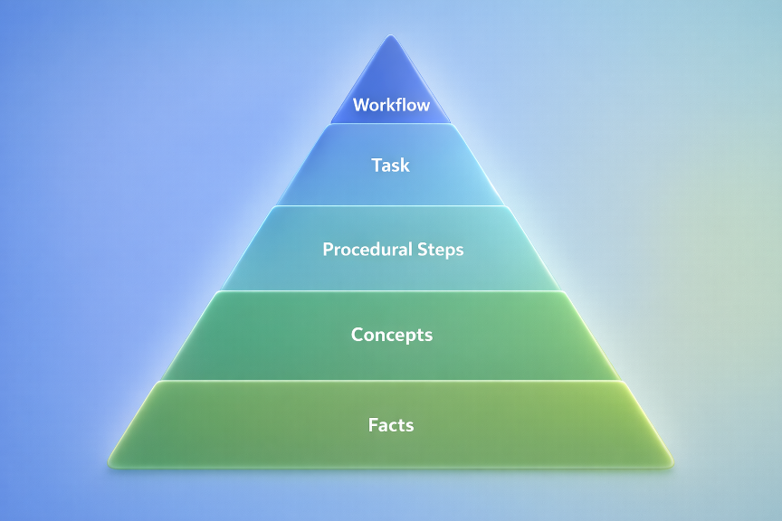
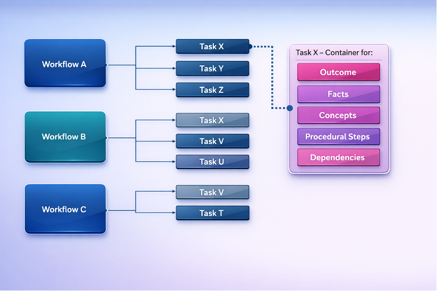

# Introduction: The Technical Learning Content Hierarchy

## Purpose of This Document

This document defines how technical learning content is constructed,
governed, and delivered across all formats in our ecosystem. It ensures
that every piece of content, whether a written guide, workflow, video,
SCORM module, or live lab, is built on a consistent, testable, and
scalable structure.

System design details live in `Learning_Content_System_Design.md`.

It is written for:

- content developers

- engineers producing procedural material

- subject-matter experts

- anyone who contributes to learner-facing content

This document does not teach learning theory. Instead, it provides
standards that must be followed, regardless of background or seniority
to ensure adherence to learning theory best practices.

The goals of this standard are:

1.  Consistency

2.  Accuracy

3.  Reusability

4.  Clarity

5.  Scalability

If you are creating learning content of any kind, this document tells
you:

- what you must create

- how it must be structured

- how it relates to all other content types

- how it will be delivered

## Scope

This document covers procedural execution: how to configure, operate,
and complete technical tasks and workflows. It does not cover
diagnostics, troubleshooting, strategic decision-making, or tool and
architecture selection.

## Plain-Language Standard

This document must stay readable for non-specialists. Use short
sentences, simple words, and active voice. Avoid jargon unless it is
defined in the glossary. Aim for a reading level around grade 9 or
lower, and favor clarity over formal or academic wording.

# What Is Learning

Learning is not simply the transfer of knowledge, it is the mechanism by
which change happens. When the business wants to move in a new
direction, adopt a new tool, or improve how something is done, learning
is the structured process that enables people to make that change real.

Learning exists to close a gap between current state and desired state.
It gives individuals the capability to act differently in service of
organizational goals.

The sequence is as follows:

1.  **The business identifies a need for change.** New strategies,
    products, or processes create new expectations for how people must
    perform.

2.  **We work with business leaders to define learning objectives.**
    These describe what people must be able to do to support that
    change.

3.  **We design and build content.** This enables learners to achieve
    those objectives in the form of workflows, modules, or other
    experiences.

4.  **We validate learning through knowledge checks and examinations.**
    These confirm that learners can perform the required steps and apply
    them in context. (Note: Assessment is deferred for MVP and will be
    covered in a separate standard.)

In short, learning is part of a strategic continuum, from business
intent, to defined objectives, to structured content, to measurable
outcomes. When we treat learning as the tool that enables change, every
piece of content we create has a clear purpose and measurable impact.

## A Note on Learning Objectives

Before any content development or standardization activities begin,
clear learning objectives must be established. These objectives
articulate the desired learner outcomes and provide the foundation for
all subsequent design, development, and evaluation work.

In this standard, objectives belong to workflows and are defined by the
organization. Tasks do not have objectives; they have outcomes.

Once objectives have been defined and aligned to business or
organizational goals, the Learning Content Standards described in this
document can be applied to ensure quality, consistency, and measurable
impact.

Additional information on the development of Learning Objectives can be
found at the end of this document in the appendix.

## What does effective learning content look like and what these standards define

These standards break technical learning into a small number of building
blocks, give each block a clear name, and explain how those blocks fit
together. Every piece of learning content you create comes from this
structure.

|  |  |  |
|----|----|----|
| **Facts** | the literal information the learner must know | What |
| **Concepts** | the mental models built from those facts | Why |
| **Steps** | the steps the learner must perform | How |
|  |  |  |
| **Task** | a procedure of steps producing one outcome |  |
| **Workflow** | a sequence of tasks producing a larger objective |  |

## Hierarchical Diagram:

## Functional Diagram:

## Working Example 1: Brushing Your Teeth (Simple Demonstration Only)

*This example is intentionally non-technical. It exists only to
demonstrate how the learning components fit together before applying the
same structure to real technical tasks.*

### Outcome

Perform a complete tooth‑brushing routine that effectively removes
plaque.

### Facts (literal information the learner must know)

- Toothpaste contains ingredients (e.g., fluoride, abrasives) that help
  clean and protect teeth.

- Brushing removes plaque from the surfaces of teeth and gums.

- All surfaces of the teeth require cleaning: front, back, chewing
  surfaces, and gumline.

- Applying excessive pressure can damage gums.

### Concepts (mental models built from those facts)

#### **Concept: What brushing actually does**

- **Why the procedure matters:**  
  If plaque is not regularly removed, it can lead to tooth decay, gum
  disease, and long-term dental damage.

- **Why the mechanism exists:**  
  Plaque naturally accumulates on teeth through everyday eating and
  bacterial activity and cannot be removed without mechanical cleaning.

- **How the system behaves / what is happening under the surface:**  
  Brushing uses gentle mechanical movement, combined with toothpaste, to
  break up and remove plaque from the surfaces of the teeth and gums.

#### **Concept: Coverage**

- **Why the procedure matters:**  
  Areas that are not brushed remain vulnerable to plaque buildup and
  decay.

- **Why the mechanism exists:**  
  Teeth have multiple surfaces, and plaque does not accumulate evenly.

- **How the system behaves / what is happening under the surface:**  
  Effective brushing requires reaching all tooth surfaces so no area is
  left uncleaned.

#### **Concept: Duration and Pressure**

- **Why the procedure matters:**  
  Brushing too briefly may leave plaque behind, while excessive pressure
  can damage gums and enamel.

- **Why the mechanism exists:**  
  Plaque removal depends on sufficient contact time and appropriate
  force.

- **How the system behaves / what is happening under the surface:**  
  Brushing should last long enough to be effective and use light
  pressure to avoid gum damage.

*(No analogy is required for this example, as the concepts are already
familiar and concrete.)*

### Procedure (the steps performed to complete the task)

1.  Apply toothpaste to the brush.

2.  Place the brush against the teeth at a slight angle.

3.  Move the brush in small circular motions across all outer surfaces.

4.  Brush the chewing surfaces.

5.  Brush the inside surfaces.

6.  Brush gently along the gumline.

7.  Spit out excess toothpaste.

8.  Rinse the toothbrush.

Each step is atomic, observable, and does not embed reasoning.

### Task (single outcome)

#### Task: Brush your teeth

- **Outcome:** All surfaces of the teeth and gumline have been cleaned.

- **Facts:**

  1.  Toothpaste contains ingredients (e.g., fluoride, abrasives) that
      help clean and protect teeth.

  2.  Brushing removes plaque from the surfaces of teeth and gums.

  3.  All surfaces of the teeth require cleaning: front, back, chewing
      surfaces, and gumline.

  4.  Applying excessive pressure can damage gums.

- **Concepts:**

  1.  What brushing does

  2.  Coverage

  3.  Duration and pressure

- **Dependencies:**

  1.  Toothbrush and toothpaste available

  2.  Access to water

  3.  Understanding of safe brushing pressure

- **Procedure (Steps):**  
  (as above)

This is a complete, atomic task producing one outcome.

### Workflow (larger outcome composed of tasks)

#### Workflow: Perform a basic morning hygiene routine

**Core Tasks:**

1.  Wash your face

2.  Brush your teeth

3.  Comb your hair

Each task is atomic and could be reused in other workflows. For example,
you might have a nighttime routine which might have:

1.  Wash your face

2.  Brush your teeth

But does not have “Comb your hair” and has other tasks instead.

**Workflow Objective:**  
A basic morning personal hygiene routine has been completed.

### Purpose of this Example

This example has *no connection* to technical work.  
Its purpose is to show how:

- facts feed concepts

- concepts support procedural steps

- steps complete a task

- tasks form a workflow

## Working Example 2: Enabling Immutability on a Backup Repository (Technical Demonstration)

*This example demonstrates how the learning components apply to a real
technical task using the same structure shown in Example 1.*

*It shows the transition from a simple conceptual model to an applied
technical workflow.*

### Outcome

Configure immutability on a backup repository to protect backup data
from modification or deletion during the defined lock period.

### Facts (literal information the learner must know):

- Immutable storage prevents modification or deletion of protected
  backup objects during the lock period.

- The immutability period cannot be shortened once configured.

- Only storage systems supporting Object Lock (or equivalent) can
  enforce immutability.

- Backup systems reject any operation that violates immutability.

### Concepts (mental models built from those facts):

#### Concept: What immutability does

Immutability enforces a time-based lock that prevents alteration or
deletion of backup data, even by administrators.

#### Concept: Storage behavior under immutability

1.  New data can always be written.

2.  Existing locked data cannot be changed or removed.

3.  Data becomes removable only after the lock period expires.

#### Concept: Retention alignment

The immutability duration must meet or exceed organizational retention
requirements.

### Procedure (steps performed to complete the task):

1.  Open the backup console.

2.  Navigate to Backup Infrastructure.

3.  Select the target object-storage repository.

4.  Open the repository configuration panel.

5.  Enable the immutability or Object Lock feature.

6.  Set the required immutability duration.

7.  Save and apply the configuration.

### Task (single outcome):

Task: Enable immutability on a backup repository

- **Outcome:** The repository becomes protected by an immutability
  period preventing modification or deletion of stored backup objects.

- **Dependencies**:

<!-- -->

- A functional object-storage repository already exists.

- The user has administrative permissions.

- The storage platform supports immutability.

### Workflow (larger outcome composed of tasks):

Workflow: Configure ransomware-resilient backup storage

**Core Tasks:**

1.  Create or select a compatible object-storage repository.

2.  Enable immutability on the repository.

3.  Attach the repository to one or more backup jobs.

4.  Run an initial backup job to confirm proper data protection.

**Workflow Objective:**

Backups are protected by immutability, ensuring stored data cannot be
altered or deleted during the defined lock period.

### Purpose of This Example:

This example shows how the learning hierarchy applies to real technical
domains, mirroring the structure of Example 1 while demonstrating a
workflow relevant to engineers and SMEs.

# Workflow Standards

## What a Workflow Is

A workflow is a defined sequence of tasks that together produce one
meaningful, verifiable objective. It represents an actual transformation
in the system, not a topic, not a lesson, and not a collection of
loosely related steps.
Workflows contain tasks only; they do not contain other workflows.

### Single-Task Workflows

A workflow may consist of one task if that task alone produces the
defined outcome. It is still treated as a workflow, documented using the
same structure, and subject to the same quality rules.

## Task Relationships Inside a Workflow

### Core Tasks

These are the tasks that directly produce the workflow objective. If a
core task is removed, the objective cannot be achieved.

### Prerequisite Tasks

These are tasks that must already be completed before the workflow
begins. They enable the workflow but are not part of the transformation
it performs.

## Defining Rule

- If the task produces the outcome, it is a core task.

- If the task enables the workflow but does not create the outcome, it
  is a prerequisite task.

This rule is universal and applies regardless of how simple or complex
the workflow is.

## Reusability

Tasks are atomic and reusable.

A task may be a core task in one or multiple workflows and a
prerequisite in another(s).

This is expected and desirable.

## Variants

Workflow variants are expressed by composition, not conditional steps.
If a workflow needs an extra capability (for example, enabling
encryption), add that as a separate task and include or omit it at the
workflow level.

## Workflow Documentation Structure

- **Overview** – what the workflow achieves and why it matters.

- **Prerequisites** – prerequisite tasks, permissions, or conditions.

- **Tasks** – the core tasks that produce the outcome.

- **Objective** – the measurable outcome the workflow achieves.

## Safety Rules

To maintain consistency and prevent design drift:

1.  Prerequisite tasks must not appear in the core task list.

2.  Core tasks must not be moved into prerequisites.

3.  A workflow must have one clearly defined objective.

4.  If the objective cannot be stated clearly, the workflow is likely
    mis-scoped.

5.  Core tasks must be atomic, outcome-driven, and testable.

6.  Single-task workflows are valid and follow the same rules.

7.  Task outcomes must roll up to the workflow objective.

# Task Standards

## What a Task Is

A task is the smallest atomic unit of meaningful work.

It produces one outcome and can be completed independently of other
tasks.

It is atomic, reusable, and defines how one thing is done within the
system.

A task is not:

- a workflow,

- a collection of unrelated steps,

- a concept explanation,

- or a topic.

It exists solely to produce a single, testable change in system state.

## Required Structure

Every task contains five elements:

1.  **Outcome** – the title stated as a verb-driven outcome.

2.  **Facts** – literal information the learner must know beforehand.

3.  **Concepts** – the mental models required to understand why the
    steps work.

4.  **Procedure** – the named sequence of steps that perform the task.

5.  **Dependencies** – prerequisites that must already be true or
    completed.

Steps are stored as a Steps array within the Procedure.

If any of these components is missing, the task cannot be validated.

## Procedure and Steps

The **procedure** is the named sequence of **steps** used to complete
the task.

Steps must follow strict rules:

- The procedure name is required, and steps are stored as a Steps array.

- Steps are **atomic instructions**, not tasks.

- One operation per step.

- No compound or nested steps.

- No conditional logic built into the step.

- Each step is executable exactly as written.

Steps describe *what the learner does*, not *why they do it*.

### Procedure Step Atomicity

An atomic Step MUST meet all of the following:

- The Step MUST contain one primary action only.

- The Step MUST name an explicit object or target (file, command,
  config key, UI control, etc.).

- The Step MUST include an observable completion condition (what
  indicates the step is complete).

- The Step MUST NOT hide tool choice; it MUST specify a concrete method
  or an approved tool-class pattern (e.g., a text editor with elevated
  permissions).

Why this exists: atomic steps are executable, reviewable, and
unambiguous.

### Tool Specificity Policy

- Canonical Task Procedures MUST allow tool-class specificity (e.g., “a
  text editor”) to remain environment-agnostic.

- Derived or beginner views SHOULD provide concrete tool examples (e.g.,
  nano or vi) without altering the canonical Step text.

- Environment profiles (future) SHOULD define default tool choices.

Why this exists: tool choice varies by environment, but procedure intent
must remain stable.

### Example: fstab Step Atomicity

**Bad:** Edit /etc/fstab.

**Good (decomposed Steps):**

1.  Open /etc/fstab in a text editor with elevated permissions.

2.  Insert a new mount entry line containing UUID, mount point,
    filesystem type, and mount options.

3.  Save the file.

4.  Exit the editor.

5.  Run `mount -a` and confirm it exits successfully.

Why this exists: the example demonstrates single-action steps with
explicit method and completion checks.

See **Heuristic Validation Rules for Steps (MVP)** in the Quality Gate
section for warning-level checks.

## Outcome Requirements

A valid task must produce an outcome that is:

- **observable**

- **verifiable**

- **unambiguous**

- **repeatable**

If you cannot walk into the system and confirm whether the task outcome
occurred, it is not a valid task.

## Boundaries

A task becomes invalid if:

- it contains **more than one outcome**

- it embeds **subtasks** or multi-part steps

- it requires knowledge not expressed through its facts, concept, or
  dependencies

- it depends on scenario-specific detail that prevents reuse

Clear boundaries ensure tasks remain consistent across workflows.

## Reusability

Tasks must be **workflow-agnostic**.  
A task is written to describe *how the system behaves*, not how one
workflow uses it.

A task may appear:

- as a core task in one workflow

- as a prerequisite in another

No part of the task description should assume where or how it will be
used.

## Quality Gate

A task cannot pass review unless all criteria are met:

1.  It produces **one** testable outcome.

2.  Its steps are **atomic and imperative**, written cleanly.

3.  All required concepts and facts are provided.

4.  Dependencies are complete and correct.

5.  The task is reusable across multiple workflows.

6.  The task outcome matches actual system behavior in all supported
    environments.

Any violation means the task must be revised before it can be referenced
in a workflow.

### Heuristic Validation Rules for Steps (MVP)

These checks SHOULD flag as warnings (not hard failures unless a
document already defines hard failures):

1.  **Abstract verbs warning:** Validation SHOULD flag steps containing
    abstract or bundling verbs such as edit, configure, set up, manage,
    ensure, handle, prepare, troubleshoot. These terms are acceptable
    only if the Step includes a concrete method (command or tool-class)
    OR is immediately followed by decomposed Steps that specify method
    and completion.

2.  **Multi-action detector:** Validation SHOULD flag steps containing
    conjunctions that imply multiple actions (and, then, also, as well
    as). Validation SHOULD also flag steps that contain multiple
    imperatives (heuristic: two verbs in one Step).

3.  **Completion/verification expectation:** If a Step claims a state
    change (install, mount, enable, add, update, remove), it MUST either
    include an explicit confirmation check in the same Step or be
    followed by a Step that confirms it. “Verify it works” is not
    acceptable; the confirmation MUST name the check (command,
    observable output, exit code, etc.).

Human review MUST be the final semantic gate for Step correctness and
intent.

Why this exists: heuristic checks reduce ambiguity, but semantic
correctness still requires human judgment.

# Concept Standards

## What a Concept Is

A **concept** is a mental model the learner must understand to perform a
task correctly.

Concepts explain:

- **why** the procedure matters (what is the value?)

- **why** the mechanism exists (what issue is being addressed?)

- **how** the system behaves

- **what** is happening under the surface

A concept is **not**:

- a definition from product documentation

- a task

- a list of facts

- a deep technical essay

- marketing language

A concept exists solely to support task execution by giving the learner
the right mental model.

## Causality Rule

A concept must explain the system pressure that created the mechanism.
If it does not answer “why was this feature designed, and what problem
did it solve,” it does not belong in the concept.

## Required Structure

1.  Definition

2.  Purpose

3.  Behavior

4.  Optional Analogy

## Analogy Rules

Analogies must:

- be domain-reflective

- have accurate mapping

- include limitations if relevant

## Governance and Versioning (MVP)

All records are governed at the record level.

- Every Task and Workflow starts in an **unconfirmed** state.

- A human reviewer must confirm a record before it can be published.

- AI-assisted ingress is allowed, but AI-created records are still
  unconfirmed until reviewed by a human.

- Any edit creates a new version. Only one version can be confirmed at a
  time.

- Older confirmed versions are deprecated, not deleted.

### Required Version Fields (MVP)

- record_id

- version

- status (draft, unconfirmed, confirmed, deprecated)

- created_at, updated_at

- created_by, updated_by

- reviewed_by, reviewed_at

- change_note

### Change Monitoring

An AI agent monitors R\&D changelogs and flags affected Tasks or
Workflows for review.

## Model Evolution Policy

There are no content exceptions. If a task or workflow does not fit the
model, it triggers a model change request.

Each model change request must include:

- Problem statement

- Affected records

- Proposed schema or rule change

- Migration impact

All model changes require human approval. When approved, a new model
version is published and affected records are flagged for update.

## Glossary (Canonical Terms)

- **Objective** – org-defined outcome at the Workflow level. Not authored
  by content writers.

- **Outcome** – atomic, observable state change produced by a Task.

- **Task** – smallest reusable unit of work that produces one Outcome.

- **Workflow** – ordered composition of Tasks that achieves one
  Objective.

- **Facts** – literal information required to execute a Task. Stored as
  an array in the Task.

- **Concepts** – minimal mental models required to execute a Task
  correctly. Stored as an array in the Task.

- **Procedure** – the named sequence of Steps that executes a Task.

- **Steps** – atomic, imperative instructions within a Procedure. Steps
  are the only term for atomic actions.

- **Dependencies** – conditions or prerequisites that must be true
  before a Task can be executed.

- **Prerequisites** – conditions or Tasks that must be true/complete
  before a Workflow can be executed.

# Appendix I - Guidance for Defining and Writing Learning Objectives

The following sections provide additional reference material for teams
responsible for establishing learning objectives prior to applying the
Learning Content Standards outlined in this document.

## Defining Learning Objectives and Strategic Alignment

Before any learning content is developed, the learning objectives must
be clearly defined. The simplest way to frame this is to ask:

> **“What do we want the learner to be able to do that they cannot do
> right now?”**

This question establishes the measurable action or capability that the
learning experience will enable.

### Ownership of Objectives

It is important to note that the training or learning team does not
determine these objectives. The responsibility for defining what
capabilities need to be developed lies with the business leaders or
project owners who understand the strategic goals of the organization, a
learning intervention is put in place to change behaviour and by
extension execute on strategic objectives, so learning teams should not,
by definition, be formulating objectives in isolation.

Our role as the learning development team is to:

- Translate those strategic objectives into effective learning
  experiences.

- Design workflows and learning paths that enable the desired
  performance outcomes.

- Ensure that content structure, delivery methods, and assessments align
  to those objectives.

Training is a strategic investment, not merely an activity to 'make
people better.' Every learning initiative should be directly tied to a
defined business purpose — whether it’s improving operational
efficiency, enabling new capabilities, or supporting a transformation
initiative. When learning teams attempt to define objectives
independently, they risk misalignment with organizational priorities and
misallocation of resources.

### Writing Effective Objectives

Objective writing is a discipline of its own, this document will not
attempt to fully outline it. (For further guidance, speak with Ewan
Matheson and/or refer to Bloom’s Taxonomy for structuring learning
outcomes) Although there is one fundamental principle that underpins all
effective learning design:

> We never teach people to understand something; we teach them to do
> something.

Learning objectives must therefore be action‑oriented. They should
describe what the learner will do because of the training, not what they
will know or understand. Good objectives use verbs that express
observable behavior, for example: configure, analyze, diagnose,
demonstrate, build, or execute, rather than abstract states like
understand, know, or appreciate.

### Guidance for Writing Strong Objectives

When drafting objectives:

- Begin with action verbs that describe measurable performance (e.g.,
  configure, perform, analyze, create, validate).

- Ensure every objective can be tested, demonstrated, or observed
  through an activity, assessment, or workflow.

- Verbs such as understand, know, learn, be aware of, or appreciate are
  banned. They do not describe measurable actions and therefore cannot
  form part of a valid learning objective.

- Each objective must be linked to a business outcome. The objective
  should exist to enable a specific performance or capability that
  supports strategic goals.

- Rule: If you cannot observe or measure it, it is not an objective.

By enforcing this standard, we ensure that every piece of learning
content is actionable, measurable, and strategically aligned.

